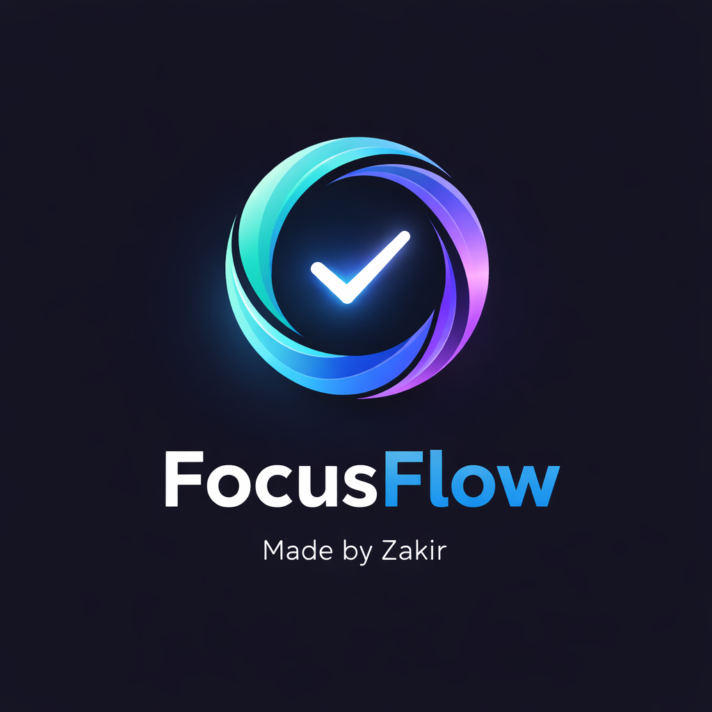
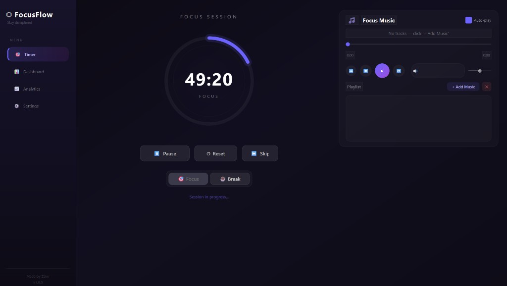
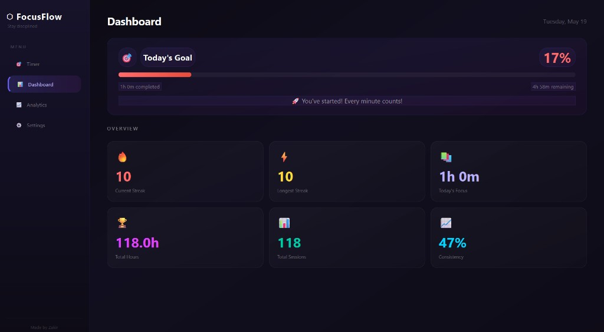
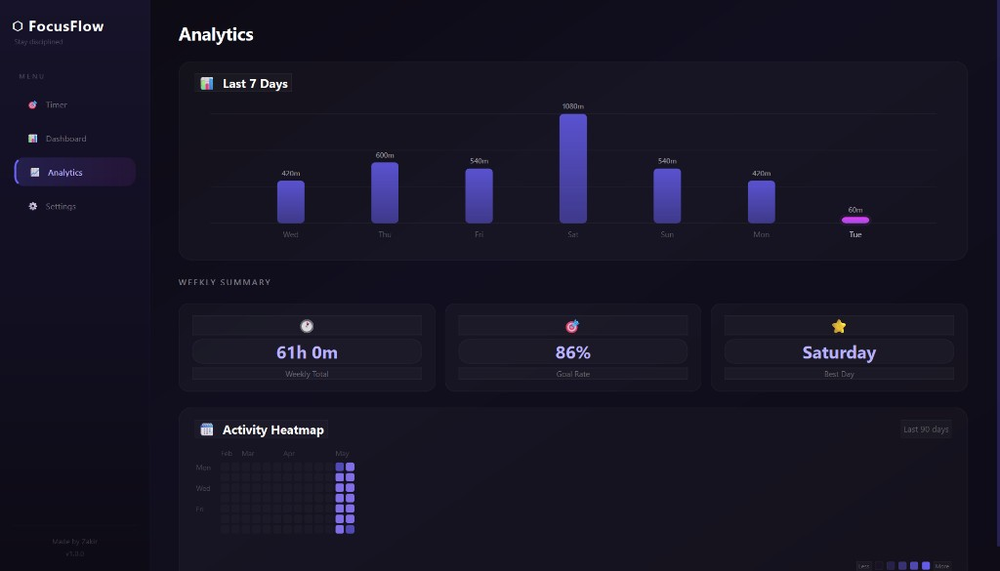
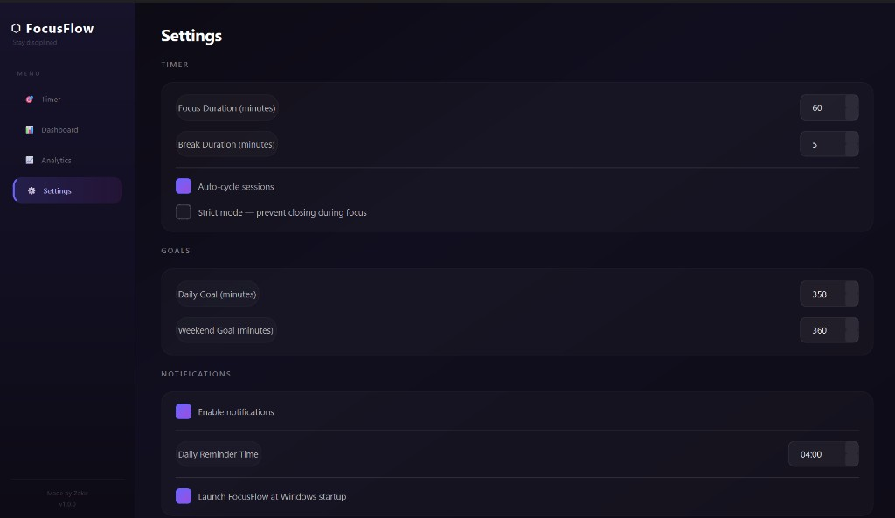

# FocusFlow

**Personal discipline & study optimization for Windows**

FocusFlow is a modern desktop app that helps you stay consistent with focus sessions, daily study goals, streaks, and visual progress tracking — all in one polished dark UI.

Made by **Zakir** · v1.0.0

<p align="center">
  
</p>

<p align="center">
  <a href="https://github.com/abzakir/FocusFlow/releases/latest">
    
  </a>
</p>

---

## Download (Windows)

**No Python required.** Get the latest build from [GitHub Releases](https://github.com/abzakir/FocusFlow/releases/latest).

| Asset | Description |
|-------|-------------|
| **`FocusFlow.exe`** | Standalone app — download, run, and start focusing |
| **`FocusFlow_Setup.exe`** *(optional)* | Windows installer if you publish it alongside the portable EXE |

### Install & run

1. Open **[Releases](https://github.com/abzakir/FocusFlow/releases/latest)** and download **`FocusFlow.exe`** (or the setup wizard).
2. Save it anywhere you like (e.g. `Downloads` or `C:\Program Files\FocusFlow`).
3. Double-click **`FocusFlow.exe`** to launch.
4. On first run, Windows may show SmartScreen (“Windows protected your PC”). Click **More info** → **Run anyway** if you trust this release.

Your data is stored locally at `%APPDATA%\FocusFlow\focusflow.db` — updating the EXE does not delete your sessions, goals, or streaks.

> **Developers:** To run or modify the source code, see [Quick start (from source)](#quick-start-from-source) below.

---

## Screenshots

### Timer — Focus sessions & music player

Pomodoro-style focus/break timer with a circular progress ring, session controls, and an integrated focus music player (playlist, shuffle, auto-play).

<p align="center">
  
</p>

### Dashboard — Daily goals & streaks

Track today's goal progress, current/longest streaks, total focus hours, sessions, consistency, and motivational feedback.

<p align="center">
  
</p>

### Analytics — Charts & activity heatmap

7-day bar chart, weekly summary stats, and a 90-day GitHub-style activity heatmap.

<p align="center">
  
</p>

### Settings — Fully configurable

Customize focus/break durations, daily & weekend goals, notifications, reminders, auto-cycle, strict mode, and Windows startup.

<p align="center">
  
</p>

---

## Features

| Area | What you get |
|------|----------------|
| **Timer** | Focus & break modes, start/pause/reset/skip, optional auto-cycle between sessions |
| **Goals** | Separate weekday & weekend daily targets with color-coded progress |
| **Streaks** | Current & longest streak, milestones (3, 7, 14, 21, 30, 50, 100 days), missed-day nudges |
| **Analytics** | Last 7 days chart, weekly total, goal rate, best day, 90-day heatmap |
| **Music** | Built-in player — MP3, WAV, OGG, FLAC, M4A, WMA, AAC; shuffle & auto-play on focus |
| **Reminders** | Scheduled daily reminders with escalation if you haven't started yet |
| **Notifications** | Session complete, goal reached, streak milestones, system tray minimize |
| **Strict mode** | Optional lock — prevent closing the app during an active focus session |

---

## Tech stack

- **Python 3** + **PySide6** (Qt 6)
- **SQLite** — local data at `%APPDATA%\FocusFlow\focusflow.db`
- **PyInstaller** — standalone `.exe`
- **Inno Setup** — Windows installer (optional)

---

## Requirements

| Use case | Requirements |
|----------|----------------|
| **End users** | Windows 10/11 — use the [release EXE](#download-windows) |
| **Developers** | Windows 10/11, Python 3.10+ |

---

## Quick start (from source)

```bash
# Clone the repository
git clone https://github.com/abzakir/FocusFlow.git
cd FocusFlow

# Create a virtual environment (recommended)
python -m venv venv
venv\Scripts\activate

# Install dependencies
pip install -r requirements.txt

# Run the app
python main.py
```

Place `Logo.png` in the project root for the splash screen and taskbar icon (included in releases).

---

## Build & publish to GitHub Releases

```bash
pip install -r requirements.txt

# Build with PyInstaller
pyinstaller focusflow.spec

# Output: dist/FocusFlow.exe
```

For a full Windows installer (requires [Inno Setup 6](https://jrsoftware.org/isinfo.php)):

```bash
python build_installer.py
# Installer output: installer_output/FocusFlow_Setup.exe
```

### Upload a new release

1. Build `dist/FocusFlow.exe` (and optionally `installer_output/FocusFlow_Setup.exe`).
2. On GitHub: **Releases** → **Draft a new release** → choose a tag (e.g. `v1.0.0`).
3. Attach **`FocusFlow.exe`** (and the setup file if you built it) under **Release assets**.
4. Publish the release — the [Download](#download-windows) links in this README point to the latest release automatically.

---

## Default settings

| Setting | Default |
|---------|---------|
| Focus duration | 30 minutes |
| Break duration | 5 minutes |
| Daily goal (weekday) | 120 minutes |
| Weekend goal | 60 minutes |
| Daily reminder | 09:00 |
| Auto-cycle sessions | Off |
| Strict mode | Off |
| Music auto-play on focus | On |

All values are editable in **Settings** and stored in the local database.

---

## Project structure

```
FocusFlow/
├── main.py                 # Application entry point
├── core/                   # Timer, goals, streaks, reminders, music engines
├── ui/                     # Main window & views (Timer, Dashboard, Analytics, Settings)
├── database/               # SQLite schema & db_manager
├── utils/                  # Notifications, helpers, animations
├── docs/screenshots/       # README screenshots
├── Logo.png                # App icon & branding
├── focusflow.spec          # PyInstaller spec
├── build_installer.py      # EXE + installer automation
└── requirements.txt
```

---

## How it works

1. **Start a focus session** on the Timer page — time is logged to SQLite when the session completes.
2. **Daily goal progress** updates from completed focus minutes (breaks do not count).
3. **Completing your daily goal** advances your streak and can trigger celebration notifications.
4. **Analytics** aggregates session history into charts and the heatmap.
5. **Closing the window** minimizes to the system tray when notifications/tray are enabled.

---

## Contributing

Issues and pull requests are welcome. Please open an issue first for large changes.

---

## Author

**Zakir** — FocusFlow v1.0.0


